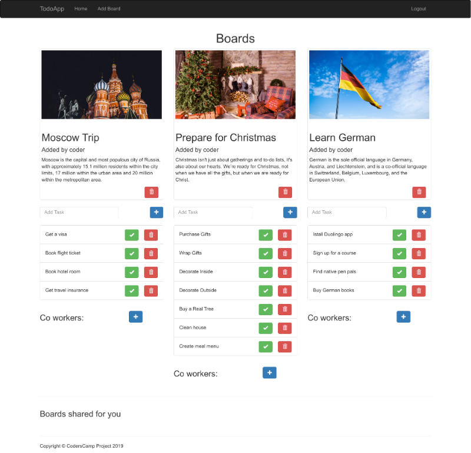

# Simple todo app
Project made during [CodersCamp](https://coderscamp.edu.pl/) course.

## Installation
1. Clone or download the repo.
2. Download, install and run [MongoDB Community Server](https://www.mongodb.com/what-is-mongodb)
3. Assuming that you have at least Node 10 LTS installed, use npm to install: `npm install`
4. Once the installation is done, you can run the project:
   `npm start`
5. Open http://localhost:9090 to view in the browser.

